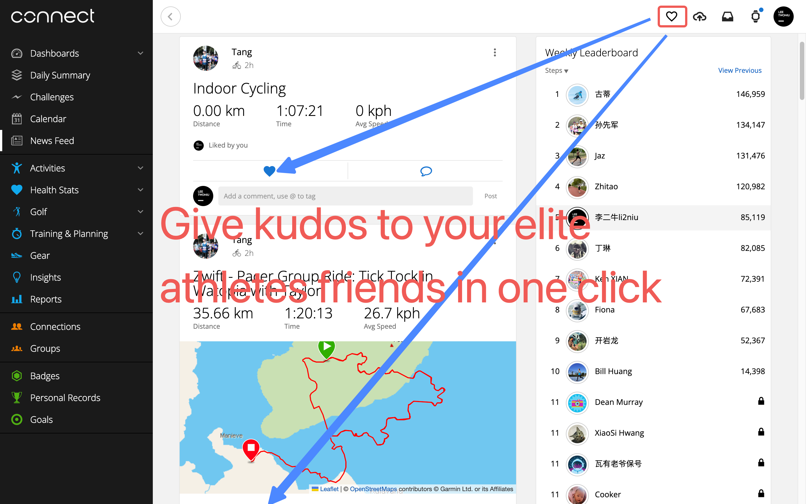

# GCW&Strava Kudo All

这是一个 Chrome/Firefox/Safari 插件，用于在 [GCW（Garmin Connect Web）](https://connect.garmin.cn/app/newsfeed) 和 [Strava](https://www.strava.com/dashboard) 中一键给你的精英运动员朋友们点赞。

[English](./README.md)

## 截图

## 下载安装

- [Firefox](https://addons.mozilla.org/en-US/firefox/addon/kudo-all/)
- [Google Chrome](https://chrome.google.com/webstore/detail/gcw-and-strava-kudo-all/folhiecfhnmdniibjjcfogpdoafdamoc)
- [Safari](https://apps.apple.com/us/app/kudo-all-in-garmin-connect-web/id6458730808)
- [Microsoft Edge](https://microsoftedge.microsoft.com/addons/detail/gcw-and-strava-kudo-all/lmopbhpibkfcmbgipoalokaemgnlmjdn)
- 或者从 crx 安装 [.crx](./crx-files.md)

  

  

## 广告

- 
- [Rackerd VPS](https://my.racknerd.com/aff.php?aff=8822)
- [Immersive Translate 沉浸式翻译](https://immersivetranslate.com/?via=li2niu)

## FAQ

### 点击按钮在哪里?

GCW 中，在右上角导航栏的“上传活动”旁边。
Strava 中，在右上角导航栏的“订阅按钮”旁边。

### 有效的域名及链接

- https://connect.garmin.com/app/newsfeed
- https://connect.garmin.cn/app/newsfeed
- https://connectus.garmin.cn/app/newsfeed
- https://www.strava.com/dashboard

### 点赞的范围是?

它只会点赞你当前屏幕中的活动卡片。如果你想点更多,请滚动屏幕并点击导航栏上的按钮。

### 点赞的意义是?

- 培育你的友谊小树苗，茁壮成长。
- 鼓励你的运动员朋友，再接再厉。

### 能否支持自动点赞?

否。一次性点赞全屏的运动员已经是非常快捷高效的操作了，我们仍然需要保留一些仪式感。如果全部自动化了，乐趣又在哪里呢？

## 鸣谢

- [Strava 的 Kudo All](https://github.com/tciles/kudo-all)
- Four Times 俱乐部，因为群友我才了解到原项目的存在，并在休息日产生兴趣移植到 Garmin 平台。给四次的群友点赞，他们的努力的耕耘模样令人感动 🐶，比如蔡哥。

## 我的更多插件

- [GameraSnap-使用佳明手表控制手机拍照](https://gamerasnap.li2niu.com/)
- [更多插件](https://extensions.li2niu.com)
- [NewQRCode-在智能手表上展示二维码](https://q.li2niu.com)

## 插件友情推荐

[Strava Assistant](https://www.stravassistant.icu)

## 隐私协议

[隐私协议](./privacy-policy-zh.md)
